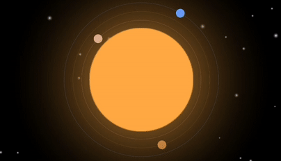
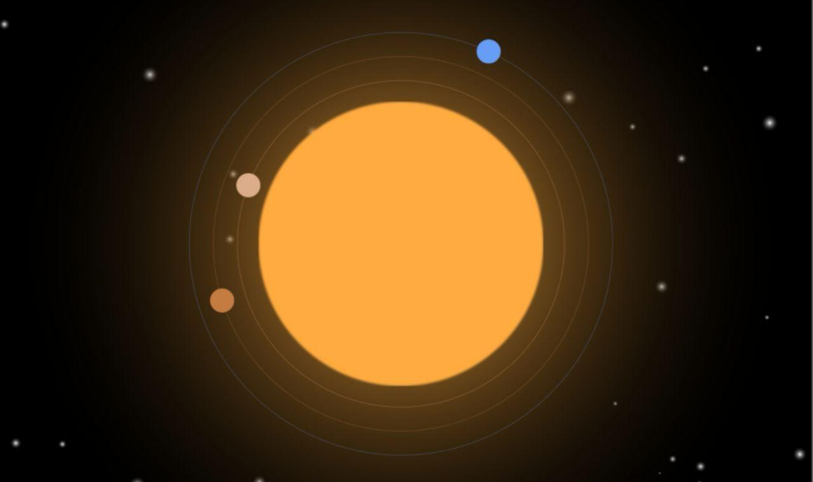
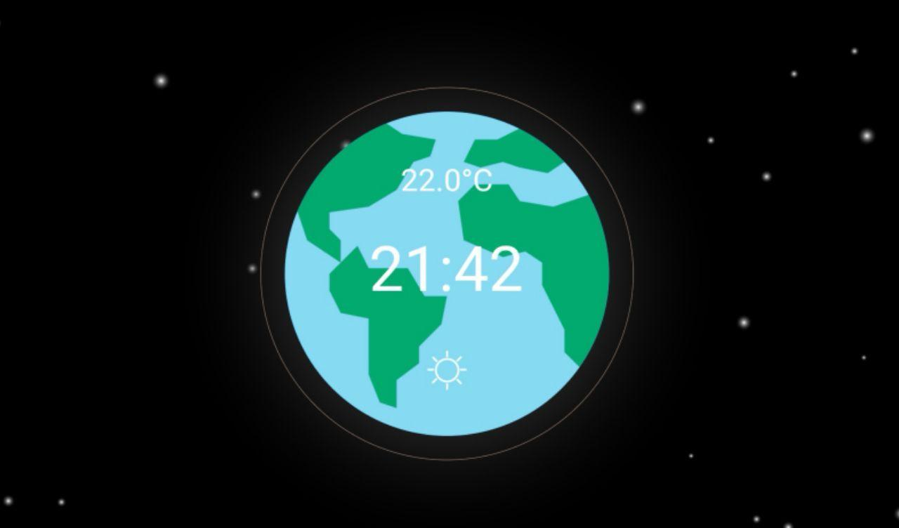
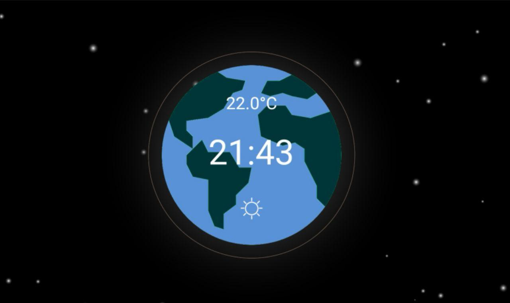

# Solar System Clock
   The application has two modes: solar and earth. Modes replace each other after 5 seconds.
   
  

## Solar mode
  
   Solar mode is an analog clock, but hands are planets which are rotates around the sun.

## Earth mode
   
   
   Earth mode is a digital clock, but it contains some additional information, such as weather or temperature.
   For each weather condition in the clock model there is an icon.

## Background
  In the background you can see falling stars or supernova explosion.
